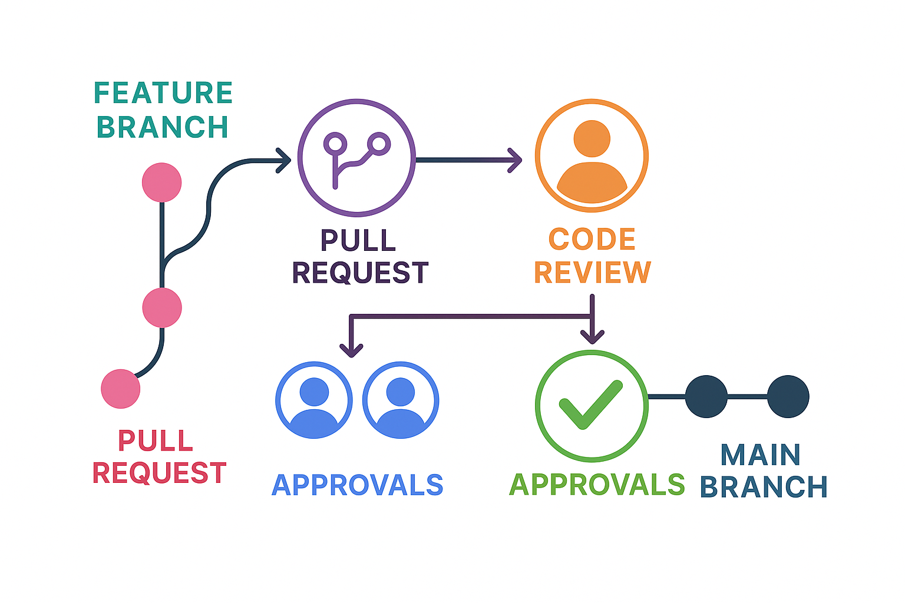
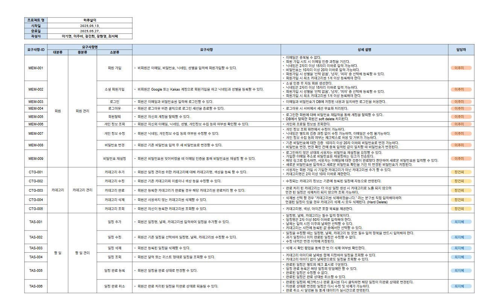
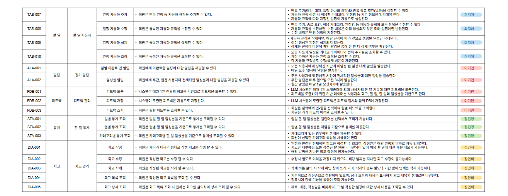

 
 be15-4th-PigMa-HaruSari
  

### 📅HaruSari

체계적인 일정 관리와 통계, 회고, 맞춤형 피드백을 통해  사용자의 자기 주도적 성장과 목표 달성을 지원하는 올인원 플랫폼

 

---

## 📚 목차

1. [pigma🐷  팀 소개](#1--팀-소개)
2. [협업🤝 전략](#2--협업-전략)
3. [프로젝트 기획서📝](#3--프로젝트-기획서)
4. [아키텍쳐 구조도⚙️](#4--아키텍쳐-구조도)
5. [기술 스택🛠️](#5--기술-스택)
6. [요구사항 명세서📋](#6--요구사항-명세서)
7. [ERD🗂️](#7--erd--테이블-정의서)
8. [REST API📡](#8--REST-API)
9. [주요 기능🚀](#9--주요-기능)
10. [빌드 및 배포 문서📦](#10--빌드-및-배포-문서)
11. [💌 팀원 회고](#11--팀원-회고)

 

---

# DevOps 프로젝트 필수 산출물

- 아래 내용이 프로젝트 채점 기준이 되는 필수 산출물
    - **프로젝트 아키텍처 구조도**
    - **빌드 및 배포 문서**
        - **Dockerfile**
        - **Kubernetes manifest**
        - **Jenkins Pipeline Script**
    - **Jenkins CI/CD 테스트 결과 화면(GIF)**
- 그 외에도 Github Repository에는 아래 내용들도 함께 정리해서 업로드
    - v 프로젝트 개요
    - 설계 문서
    - 프로젝트 코드
    - 기능 수행 테스트 결과 (화면 GIF 등)
    - v 회고

---

## 1. pigma🐷  팀 소개

 

|  |  |  |  |  |
|:------------------------------------------------------------:| :-------------------------------------: | :-------------------------------------------: | :-------------------------------------: | :-------------------------------------: 
|            [이기연](https://github.com/Lee-gi-yeun)             | [이주미](https://github.com/z00m-1n) | [장건희](https://github.com/jang9465) | [장현영](https://github.com/memory-h) | [최지혜](https://github.com/jihye25) 

 

---

## 2. 협업🤝 전략

✔️ 각자 작업 브랜치를 생성하고, 관련 이슈를 등록 
 
✔️ 작업을 완료한 후 커밋과 푸시를 진행
 
✔️ PR을 올리면 최소 2명이 코드 리뷰와 승인
 
✔️ 2명 이상 승인 시에만 main 브랜치로 머지 가능

---

## 3. 프로젝트 기획서📝

### 🧩 프로젝트 배경

> "현대인의 삶은 빠르게 변화하고 있습니다.  
> 다양한 역할과 책임 속에서 **체계적인 시간 관리**와  
> **자기 주도적 목표 달성**의 중요성이 점점 커지고 있습니다.
>
> 하지만 일상 속에서 해야 할 일들을 효율적으로 관리하고,  
> 스스로의 성과를 돌아보며 성장의 기회를 찾는 것은 쉽지 않은 일입니다."
 
>
### ❓ 문제점
- 기존 일정 관리 앱들은
    - 단순한 일정 등록과 알림 기능에 한정되어
    - **지속적인 동기 부여**와 **목표 달성 지원** 기능이 부족합니다.
       
### 🎯 프로젝트의 목표
- 사용자가 할 일(일정) 관리뿐만 아니라
- **회고**, **통계**, **알림**, **피드백**을 통해
- 자기 관리 역량을 높이고
- **지속적으로 성장**할 수 있도록 지원하는
- **통합 플랫폼 구축**

### 🌟 주요 기능

|      기능       | 설명                                           | 기대 효과                           |
|:-------------:|:---------------------------------------------|:--------------------------------|
| 📅 일정 등록 및 관리 | 일정을 손쉽게 추가, 수정, 삭제하고 완료 시 체크 표시로 구분          | 일상 관리의 편의성 향상                   |
| 🤖 반복 일정 자동화  | 반복되는 일정을 자동으로 추가 및 관리                        | 업무 효율성 증대                       |
| 🗂️ 카테고리별 관리  | 일정을 카테고리별로 분류 및 관리 카테고리별 색상 지정 및 완료 처리 가능 | 체계적 자기 관리 및 시각적 구분, 완료된 카테고리 정리 |
|   📊 달성률 통계   | 일정 및 목표의 **일일·월간 달성률**을 시각화 진행 상황을 한눈에 파악 | 동기 부여 및 자기 점검                   |
|  💡 맞춤형 피드백   | 달성 현황과 회고를 바탕으로 맞춤 피드백 제공                    | 지속적 성장 지원                       |
|     📝 회고     | 일정과 연동된 회고 작성 및 오늘의 할 일별 메모 가능               | 하루 성과와 느낀 점 기록하여 자기 성찰에 도움.     |

---

## 4. 아키텍쳐 구조도⚙️

---

## 5. 기술 스택🛠️

### Frontend

 
 

### Backend

 
 

### CI / CD

 
 

### Infrastructure

### Collaboration Tools

---

## 6. 요구사항 명세서📄

---

## 7. ERD🗂️

 

---

## 8. REST API📡

Swagger

 

---

## 9. 주요 기능🚀

### ⭐ 회원

회원 가입

・ 비회원은 이메일, 비밀번호, 닉네임, 성별을 입력해 회원가입할 수 있다.

 

소셜 회원 가입

・ 비회원은 Google 또는 Kakao 계정으로 회원가입을 하고 닉네임과 성별을 등록할 수 있다.

 

로그인

・ 회원은 이메일과 비밀번호를 입력해 로그인할 수 있다.

 

로그아웃

・ 회원은 로그아웃 버튼 클릭으로 로그인 세션을 종료할 수 있다.

 

회원탈퇴

・ 회원은 자신의 계정을 탈퇴할 수 있다.

 

개인 정보 조회/수정

・ 회원은 자신의 이메일, 닉네임, 성별, 개인정보 수집 동의 여부를 확인할 수 있다.
・ 회원은 닉네임, 개인정보 수집 동의 여부를 수정할 수 있다.

 

비밀번호 변경/재설정

・ 회원은 기존 비밀번호 입력 후 새 비밀번호로 변경할 수 있다.
・ 회원은 비밀번호를 잊어버렸을 때 이메일 인증을 통해 비밀번호를 재설정 할 수 있다.

### ⭐ 카테고리

카테고리 조회/추가/수정

・ 회원은 자신이 등록한 카테고리를 조회할 수 있다
・ 회원은 일정 관리를 위한 카테고리에 대해 카테고리명, 색상을 등록 할 수 있다.
・ 회원은 기존 카테고리의 이름이나 색상 등을 수정할 수 있다.

 

카테고리 완료

・ 회원은 등록한 카테고리가 완료될 경우 해당 카테고리를 완료처리 할 수 있다.

 

### ⭐ 할 일 

일정 추가

・ 회원은 일정명, 날짜, 카테고리를 입력하여 일정을 추가할 수 있다.

 

일정 조회

・ 회원은 달력 또는 리스트 형태로 일정을 조회할 수 있다.

 

일정 완료 등록/취소

・ 회원은 일정을 완료 상태로 변경할 수 있다.
・ 회원은 완료 처리된 일정을 미완료 상태로 되돌릴 수 있다.

### ⭐ 할 일 자동화

일정 자동화 추가

・ 회원은 반복 일정 등 자동화 규칙을 추가할 수 있다.

 

일정 자동화 조회

・ 회원은 등록된 자동화 규칙을 조회할 수 있다.

### ⭐ 알림

일별 미완료 건 알림

・ 회원에게 미완료한 일정에 대한 알림을 제공할 수 있다.

 

달성률 알림

・ 회원에게 주간, 월간 사용자의 전체적인 달성률에 대한 알림을 제공할 수 있다.

### ⭐ 피드백

피드백 도출

・ 시스템은 매월 1일 전월의 회고를 기반으로 피드백을 도출할 수 있다.

 

피드백 조회

・ 회원은 월별 피드백을 조회할 수 있다.

### ⭐ 통계

일별/월별/카테고리별 통계 조회

・ 회원은 일별/월별/카테고리별 할 일 달성률을 기준으로 통계를 조회할 수 있다.

 

### ⭐ 회고 관리

회고 작성

・ 회원은 제목과 내용의 형태로 작성 회고를 작성 할 수 있다.

 

회고 수정

・ 회원은 작성한 회고는 수정 할 수 있다.

 

회고 삭제

・ ・회원은 작성된 회고를 삭제 할 수 있다.

 

---

## 10. 빌드 및 배포 문서📦
<h2>Dockerfile</h2>

 

 
 

>FROM node:22-alpine AS build-stage
>  
>  
> LABEL authors="hyeon-young"
>  
> WORKDIR /app
>  
> ### # 변경이 없으면 캐시를 재사용하여 npm install 생략 가능
> COPY package.json package-lock.json ./
>  
> RUN npm install
>  
> COPY . .
>  
> RUN npm run build
>  
> ### # nginx 이미지를 사용하여 프로덕션 스테이지를 구성
> FROM nginx:stable-alpine AS production-stage
>  
> ### # 빌드 스테이지에서 생성된 정적 파일들을 Nginx의 기본 웹 서버 디렉토리로 복사
> ### (Nginx가 Vue.js 애플리케이션의 빌드된 파일들을 서빙)
> COPY --from=build-stage /app/dist /usr/share/nginx/html
>  
> ### # 로컬 디렉토리의 nginx.conf 파일을 Nginx의 설정 디렉토리로 복사
> COPY ./nginx.conf /etc/nginx/nginx.conf
>  
> EXPOSE 80
>  
> ### # Nginx를 포그라운드에서 실행하여 컨테이너가 계속 실행
> CMD ["nginx", "-g", "daemon off;"]
>

>
> FROM openjdk:17
>  
>LABEL authors="hyeon-young"
>  
>WORKDIR /app
>  
>COPY build/libs/*.jar app.jar
>  
>ENTRYPOINT ["java", "-jar", "app.jar"]

 

<h2>Kubernetes manifest</h2>

 

 
 

내용

 

<h2>Jenkins Pipeline Script</h2>

 

 
 

내용

 

---

## 11. 💌 팀원 회고

|**이기연**|
|------|

>

 

|**이주미**|
|------|

>

 

|**장건희**|
|------|

>

 

|**장현영**|
|------|

>

 

|**최지혜**|
|------|

>

 

---
